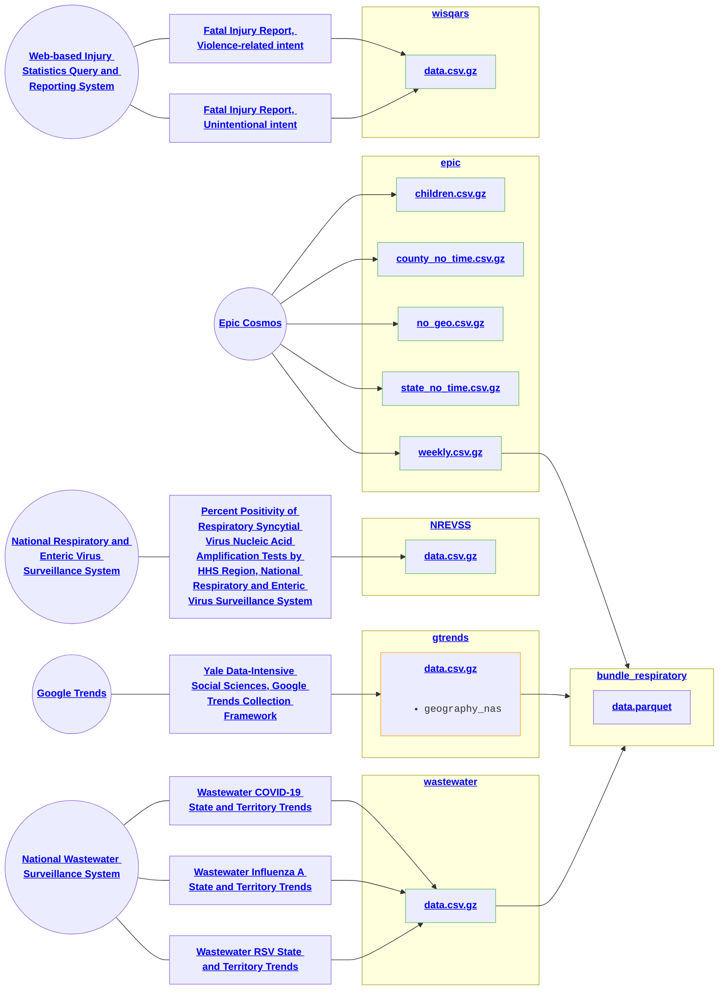

```mermaid
flowchart LR
    classDef pass stroke:#66bb6a
    classDef warn stroke:#ffa726
    classDef fail stroke:#f44336
    s0(("<strong><a href="https://cosmos.epic.com" target="_blank" rel="noreferrer">Epic Cosmos</a></strong>"))
    s1(("<strong><a href="https://trends.google.com" target="_blank" rel="noreferrer">Google Trends</a></strong>"))
    s3(("<strong><a href="https://www.cdc.gov/nrevss" target="_blank" rel="noreferrer">National Respiratory and Enteric Virus Surveillance System</a></strong>"))
    s5(("<strong><a href="https://www.cdc.gov/nwss" target="_blank" rel="noreferrer">National Wastewater Surveillance System</a></strong>"))
    s9(("<strong><a href="https://wisqars.cdc.gov/" target="_blank" rel="noreferrer">Web-based Injury Statistics Query and Reporting System</a></strong>"))
    subgraph epic["`<strong><a href="https://github.com/dissc-yale/pophive_demo/tree/main/data/epic" target="_blank" rel="noreferrer">epic</a></strong>`"]
        direction LR
        n1["`<strong><a href="https://github.com/dissc-yale/pophive_demo/blob/main/data/epic/standard/children.csv.gz" target="_blank" rel="noreferrer">children.csv.gz</a></strong>`"]:::pass
        n2["`<strong><a href="https://github.com/dissc-yale/pophive_demo/blob/main/data/epic/standard/county_no_time.csv.gz" target="_blank" rel="noreferrer">county_no_time.csv.gz</a></strong>`"]:::pass
        n3["`<strong><a href="https://github.com/dissc-yale/pophive_demo/blob/main/data/epic/standard/no_geo.csv.gz" target="_blank" rel="noreferrer">no_geo.csv.gz</a></strong>`"]:::pass
        n4["`<strong><a href="https://github.com/dissc-yale/pophive_demo/blob/main/data/epic/standard/state_no_time.csv.gz" target="_blank" rel="noreferrer">state_no_time.csv.gz</a></strong>`"]:::pass
        n5["`<strong><a href="https://github.com/dissc-yale/pophive_demo/blob/main/data/epic/standard/weekly.csv.gz" target="_blank" rel="noreferrer">weekly.csv.gz</a></strong>`"]:::pass
    end
    subgraph gtrends["`<strong><a href="https://github.com/dissc-yale/pophive_demo/tree/main/data/gtrends" target="_blank" rel="noreferrer">gtrends</a></strong>`"]
        direction LR
        n6["`<strong><a href="https://github.com/dissc-yale/pophive_demo/blob/main/data/gtrends/standard/data.csv.gz" target="_blank" rel="noreferrer">data.csv.gz</a></strong><br/><br/><ul><li><code>geography_nas</code></li></ul>`"]:::warn
    end
    subgraph NREVSS["`<strong><a href="https://github.com/dissc-yale/pophive_demo/tree/main/data/NREVSS" target="_blank" rel="noreferrer">NREVSS</a></strong>`"]
        direction LR
        n7["`<strong><a href="https://github.com/dissc-yale/pophive_demo/blob/main/data/NREVSS/standard/data.csv.gz" target="_blank" rel="noreferrer">data.csv.gz</a></strong>`"]:::pass
    end
    subgraph wastewater["`<strong><a href="https://github.com/dissc-yale/pophive_demo/tree/main/data/wastewater" target="_blank" rel="noreferrer">wastewater</a></strong>`"]
        direction LR
        n8["`<strong><a href="https://github.com/dissc-yale/pophive_demo/blob/main/data/wastewater/standard/data.csv.gz" target="_blank" rel="noreferrer">data.csv.gz</a></strong>`"]:::pass
    end
    subgraph wisqars["`<strong><a href="https://github.com/dissc-yale/pophive_demo/tree/main/data/wisqars" target="_blank" rel="noreferrer">wisqars</a></strong>`"]
        direction LR
        n9["`<strong><a href="https://github.com/dissc-yale/pophive_demo/blob/main/data/wisqars/standard/data.csv.gz" target="_blank" rel="noreferrer">data.csv.gz</a></strong>`"]:::pass
    end
    subgraph bundle_respiratory["`<strong><a href="https://github.com/dissc-yale/pophive_demo/tree/main/data/bundle_respiratory" target="_blank" rel="noreferrer">bundle_respiratory</a></strong>`"]
        direction LR
        n10["`<strong><a href="https://github.com/dissc-yale/pophive_demo/blob/main/data/bundle_respiratory/dist/data.parquet" target="_blank" rel="noreferrer">data.parquet</a></strong>`"]
    end
    s0 --> n1
    s0 --> n2
    s0 --> n3
    s0 --> n4
    s0 --> n5
    s1---s2["<strong><a href="https://github.com/DISSC-yale/gtrends_collection" target="_blank" rel="noreferrer">Yale Data-Intensive Social Sciences, Google Trends Collection Framework</a></strong>"]
    s2 --> n6
    s3---s4["<strong><a href="https://data.cdc.gov/resource/3cxc-4k8q" target="_blank" rel="noreferrer">Percent Positivity of Respiratory Syncytial Virus Nucleic Acid Amplification Tests by HHS Region, National Respiratory and Enteric Virus Surveillance System</a></strong>"]
    s4 --> n7
    s5---s6["<strong><a href="https://www.cdc.gov/nwss/rv/COVID19-statetrend.html" target="_blank" rel="noreferrer">Wastewater COVID-19 State and Territory Trends</a></strong>"]
    s6 --> n8
    s5---s7["<strong><a href="https://www.cdc.gov/nwss/rv/InfluenzaA-statetrend.html" target="_blank" rel="noreferrer">Wastewater Influenza A State and Territory Trends</a></strong>"]
    s7 --> n8
    s5---s8["<strong><a href="https://www.cdc.gov/nwss/rv/RSV-statetrend.html" target="_blank" rel="noreferrer">Wastewater RSV State and Territory Trends</a></strong>"]
    s8 --> n8
    s9---s10["<strong><a href="https://wisqars.cdc.gov/reports/?o=MORT&i=8&m=20810&s=0&r=0&ry=2&y1=2018&y2=2023&a=ALL&g1=0&g2=199&a1=0&a2=199&r1=MECH&r2=AGEGP&r3=STATE&r4=YEAR&r5=NONE&r6=NONE&g=00&e=0&yp=65&me=0&t=0" target="_blank" rel="noreferrer">Fatal Injury Report, Violence-related intent</a></strong>"]
    s10 --> n9
    s9---s11["<strong><a href="https://wisqars.cdc.gov/reports/?o=MORT&i=1&m=20810&s=0&r=0&ry=2&y1=2018&y2=2023&a=ALL&g1=0&g2=199&a1=0&a2=199&r1=MECH&r2=AGEGP&r3=STATE&r4=YEAR&r5=NONE&r6=NONE&g=00&e=0&yp=65&me=0&t=0" target="_blank" rel="noreferrer">Fatal Injury Report, Unintentional intent</a></strong>"]
    s11 --> n9
    n5 --> bundle_respiratory
    n6 --> bundle_respiratory
    n8 --> bundle_respiratory
```
